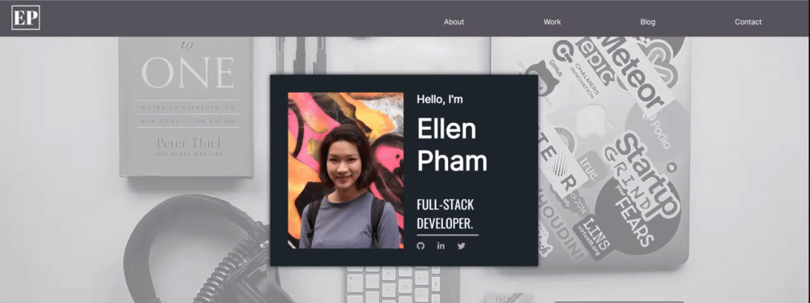
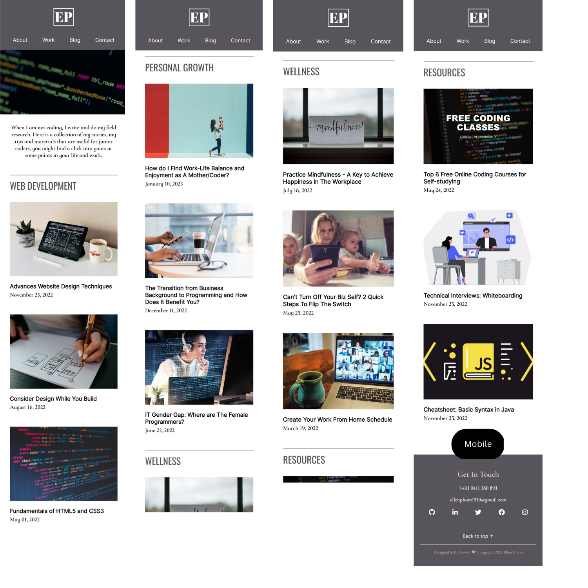

# **My Pham (Ellen) - Portfolio Website**

[Link to portfolio website](https://ellenmypham.netlify.app/)

[Link to GitHub repo](https://github.com/ellenpham/MyPham_T1A2_Portfolio-website)

[Link to presentation video](https://www.youtube.com/watch?v=c0gwoV_9B24)

# 

# Purpose
This is a personal portfolio website which I created to display my information, including my skills, my area of interest, my professional experience and my projects. The idea is to present a professional profile to potential employers who are in search of a developer or IT professional.


<br>

# Functionalities/Features

## Header
Header includes a personal logo and a navigation bar, which contains the links to the other pages of the website, listed as below:
- About: This links to About page, which includes information regarding my background, brief of work history and skills, area of interest, and a link to my full resume. 
- Work: This links to Project section, which is further down in the homepage, this will be explained more in detail later on.
- Blog: This links to Blog page, which displays my blog posts
- Contact: This links to Contact page, which contains my contact information and a form to send messages. 

The styling I am using for this component is `display:flex` for positioning the navigation items, `z-index` and `position:sticky` for a sticky navigation bar. 

When hovering over the links, the colour will slightly change from white to a pinkish colour. 

<br>

## Pages

<br>

### **Homepage**

The homepage includes five sections, listed and explained as below:

1. **Section 1: Head banner**
    
This section includes a background image and a banner on top of the background which includes my profile photo, my name, my title and links to social media. 

The main styling here is `display:flex` for styling the banner in the middle of the background and for the text to be positioned below the profile photo in mobile view and positioned to the left of profile photo in tablet/desktop view. 

The animation effect I am using here is for the banner to slowly fade in when loading page.




<br>

2. **Section 2: Short bio**
    
This section includes an overview about myself and a button which links to About page. 

Again, the main styling is `display:flex` to centre the text section and the button.

When hovering over the button, the background colour and the link will change colour.


<br>

3.  **Section 3: A showcase of my work**

This section includes an intro and a showcase of six different projects. The projects are displayed as thumbnail images with links to individual Project pages.  

The main styling for this section is `display:grid` for different layout in different media viewport. 

This section also serves as the Project page. When clicking the Work link on navigation bar, it will navigate to this section.


<br>

4. **Section 4: A list of latest blog articles**

This section includes an intro, a button with link to Blog page and a list of four latest articles with different blog topics and links to those individual articles.

The main styling I am using here is `display:grid` for the intro part in list of articles part displayed as side by side in tablet/desktop.

When hovering the button to Blog page, the background and text will change colour.


<br>

5. **Section 5: Testimonials**

This section currently displays text content only, which is my references. This is aimed to expand in content and styles when I have more resources for this section.


6.  **A bonus section**

This section just displays an image with parallax effect, for decoration purpose.

<br>


<br>

### **About**

The About page includes three main sections, listed and explained as below:

1. **Section 1: Introduction/Heading**
    
This section includes a photo of myself and a text content regarding my visions.

The key styling is `display:grid` for the photo and text content positioned as column in mobile/tablet view and side by side in desktop view. To be more specific, in mobile/tablet view, the text content is styled in a box with pinkish background and was styled to overlapped the main background, while in the desktop view, the text content is styled to have a transparent background and is completely contained within the main background.


<br>

The animation effect used here is to have the photo fading in from the right and the text content fading in from the left when loading page. I achieve this effect by using this code:
````
@keyframes image-move {
    from {left: -200px;}
    to {left: 0px}
}

@keyframes greeting-move {
    from {right: -200px;}
    to {right: 0px}
}

@keyframes para1-move {
    from {right: -200px;}
    to {right: 0px}
}

@keyframes para2-move {
    from {right: -200px;}
    to {right: 0px}
}
````

The paragraphs in the text content part fade in one by one using `animation-timing-function: ease`, `animation-timing-function: ease-out` and `animation-timing-function: ease-in-out`.

<br>


<br>

2. **Section 2: Skills and experience**
    
This section includes an brief intro about my profession, a button with link to my resume and a set of four boxes, the content in each boxes are tech skills, soft skills, education background and work history, respectively. 

The main styling is `display:flex` for centring all items in the brief intro and Grid for positioning the set of four skills boxes into a bigger square. Also, I am using Grid for differently positioning the brief intro part and the set of skill boxes in different viewport.

The animation effect I am using here is for the whole section to slowly fade in when loading page. Also, when hovering the link to resume, the button background and text will change colour. 


<br>

3.  **Section 3: Story**

This section includes text content that demonstrated my background, my personality and my interest. There are also my favourite quotes.

The styling I am using here is `display:grid` for positioning the paragraphs and the quotes in a 2:1 ratio in desktop view.

<br>
    


<br>

### **Work**

Again, the link to Work page on navigation bar will navigate to the section 3 of homepage, which showcased all projects, currently six projects are displayed.

The layout was designed with `display:grid`. When viewing in mobile, the projects are positioned vertically with one project per row. When viewing in tablet, the projects are positioned in two columns and three rows, two projects per row. When viewing in desktop, the projects are positioned in three columns and two rows, three projects per row.

<br>


<br>

The styling effect I am using here is sliding overlay effect, when moving the cursor over the images, the image overlays will slide in different directions (up, down, left, right) and appear links to individual project pages.  

When clicking on those links, it will navigate to individual Project pages. The content in each individual Project page includes a heading image and text content which is the description of all steps in the designing process and photos/screenshots taken during the process. Placeholder text is currently used in the text content. 

<br>


<br>

### **Blog**

The Blog pages contains an intro paragraph, lists of articles, which are categorized under topics. There are currently 4 topics of different genres, including website development, learning sources, personal growth and wellness tips, which are applicable in both life and work. There are three articles in each topics.   

Regarding page design, there is an image on top of the page with parallax effect, which is for decoration purpose. I used `display:grid` for the main layout of this page. In mobile/tablet view, the list of articles are positioned vertically with one article per row. In desktop view, the display is now three articles per row.

<br>




<br>

Also, when hovering the article thumbnails, the image inside will slightly increase in size. When hovering the article title, there will be underline. 

<br>


<br>

When clicking on each individual article thumbnails or articles title, it will navigate to individual Article pages. 

The Article page contains an image and text content, which includes topic, title and date published. Also, there are links to go back to the Blog page on top and bottom of the article, that is for the purpose of engaging audience in case of long content. When hovering back to blog links, the text colour will change colour from black to light pink. 

When viewing on desktop, I use `display:grid` to position a list of links aside, where you can find the links back to a particular topic and links to related articles in the same topic of the current article. When hovering those links, the text colour will change colour from black to light pink. When viewing on mobile/tablet, I use `display: none` to hide this part. 

<br>


<br>

At the moment, there are only four Article pages which were updated with full components, those are the latest article of each topic. The rest in the articles list are currently displayed as a placeholder. 


<br>

### **Contact**

The Contact page contains my contact information and a form for any queries to be sent to me. 

In mobile view, the whole page is displayed as block. While in tablet/desktop view, I used `display:grid` to position the contact information part and the form side by side with a 1:1 ratio. 

The animation effect I am using is to have the contact information part and the form fade in in different directions. I achieve this effect by using this code:
````
@keyframes info-move {
    from {bottom: -200px;}
    to {bottom: 0px}
    }

@keyframes form-move {
    from {right: -200px;}
    to {right: 0px}
    }
````

The lines in the form fade in one by one by using `animation-timing-function: ease`.

<br>


<br>

## Footer

<br>

Footer section includes my contact information (mobile number and email), links to social media (GitHub, LinkedIn, Twitter, Facebook and Instagram), a link to go back to the top of the webpage and a copyright notice in the very bottom. 

The styling I am using here is `display:flex` for positioning the items in the centre.

When hovering over the social media links, the icons' colour will change from white to pink. 

# Sitemap

Below is the sitemap for the webpage, which displays the structure of the website. To be specific, the website includes 5 pages:
1. Homepage - This page includes 5 sections (excluding header and footer) 
    - Head banner 
    - Short bio
    - Showcase of work
    - List of latest articles
    - Testimonials

<br>

2. About page

<br>

3. Work page - This page was directly linked to the 3rd section of homepage. Here, when clicking into the project's links, it will navigate to individual project pages.

<br>

4. Blog page - This page displayed a list of 4 blog topics, within each topic, there are links to the articles (currently there are 3 articles in each topic). When clicking into the article's links, it will navigate to individual pages which contains content of the article. The links to the latest articles of each topic are the same as in the list of latest articles section in homepage. Except for the latest articles, the rest of the articles are currently link to a placeholder page which shows work in progress.

<br>

5. Contact page 

<br>


Sitemap created using Figma

<br>

# Screenshots
<br>

## Homepage

### Section 1 

This section displays the header and the hero section.


### Section 2

This section displays a short bio.


### Section 3

This section displays a showcase of work.


### Section 4

This section displays the list of latest articles.


### Section 5

This section displays the testimonials and parallax effect.


### Footer

This section displays a part of parallax effect and the footer. 


<br>

## About

### Section 1 

This section displays the heading introduction.


### Section 2 

This section displays my skills, education and experience and a link to my resume.


### Section 3 

This section displays text content that demonstrates my background, personality and interest.


<br>

## Work

As mentioned above, when clicking the Work link in navigation bar, it will navigate to the Featured work section in the Homepage. 


<br>

## Project page

This page displays a heading image and the project content.

The navigation bar was designed as sticky, which causes it to stick in the middle of the page when taking a screenshot for mobile view. 


<br>

## Blog

The Blog page includes lists of articles which are categorized in four topics. There are three articles in each topic.

### **Mobile view**


### **Tablet view**


### **Desktop view**


## Article page

The Article page contains article's image and article's content. Also, when viewing on desktops, there are links for navigating to other topics and related articles.

Again, the navigation bar was designed as sticky, which causes it to stick in the middle of the page when taking a screenshot for mobile view. 


## Placeholder

The Placeholder page contains an image and a text line in with typing effect. 


## Contact

The Contact page contains contact information and a form to send queries.


<br>

# Target Audience

The website's target audience are employers or recruiters that are looking for a developer or IT specialist. The website also targeted at junior developers, self-taught coders and people with no IT background who wants to switch to tech career, especially female fellows. 

<br>

# Tech Stack
 
- Creating sitemap, wireframes and slide deck: Figma
- Code editor: VS Code
- Coding languages: HTML5, CSS, SCSS
- Version control: GitHub
- Deployment: Netlify
- Graphic design: Canva

